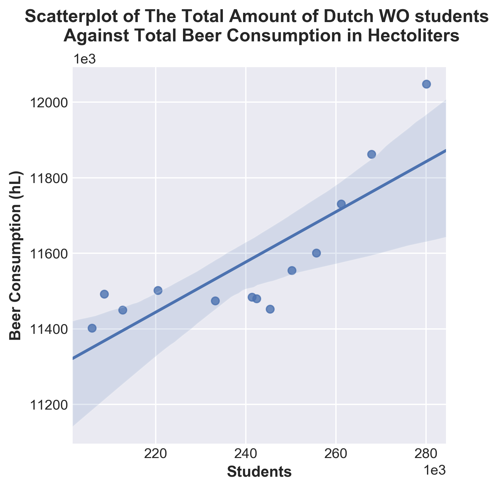

# Titles Scientific Papers

* MCC Van Dyke et al., 2019:
  - Van Dyke, M. C. C., Teixeira, M. M., & Barker, B. M. (2019). Fantastic yeasts and where to find them: the hidden diversity of dimorphic fungal pathogens. *Current opinion in microbiology*, 52, 55-63.
* JT Harvey, Applied Ergonomics, 2002:
  - Harvey, J. T., Culvenor, J., Payne, W., Cowley, S., Lawrance, M., Stuart, D., & Williams, R. (2002). An analysis of the forces required to drag sheep over various surfaces. *Applied Ergonomics*, 33(6), 523-531.
* DW Ziegler et al., 2005
  - Zeigler, D. W., Wang, C. C., Yoast, R. A., Dickinson, B. D., McCaffree, M. A., Robinowitz, C. B., & Sterling, M. L. (2005). The neurocognitive effects of alcohol on adolescents and college students. *Preventive medicine*, 40(1), 23-32.

# Visualization

One can see that when the amount of WO students is high the total beer consumption is high as well.
This possibly indicates that the total beer consumption in the Netherlands is positibely correlated with
the amount of Dutch WO student; this can also be seen by the linear regression which has a positive
slope.
